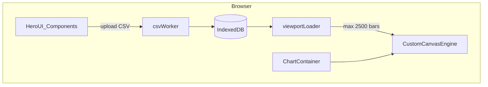
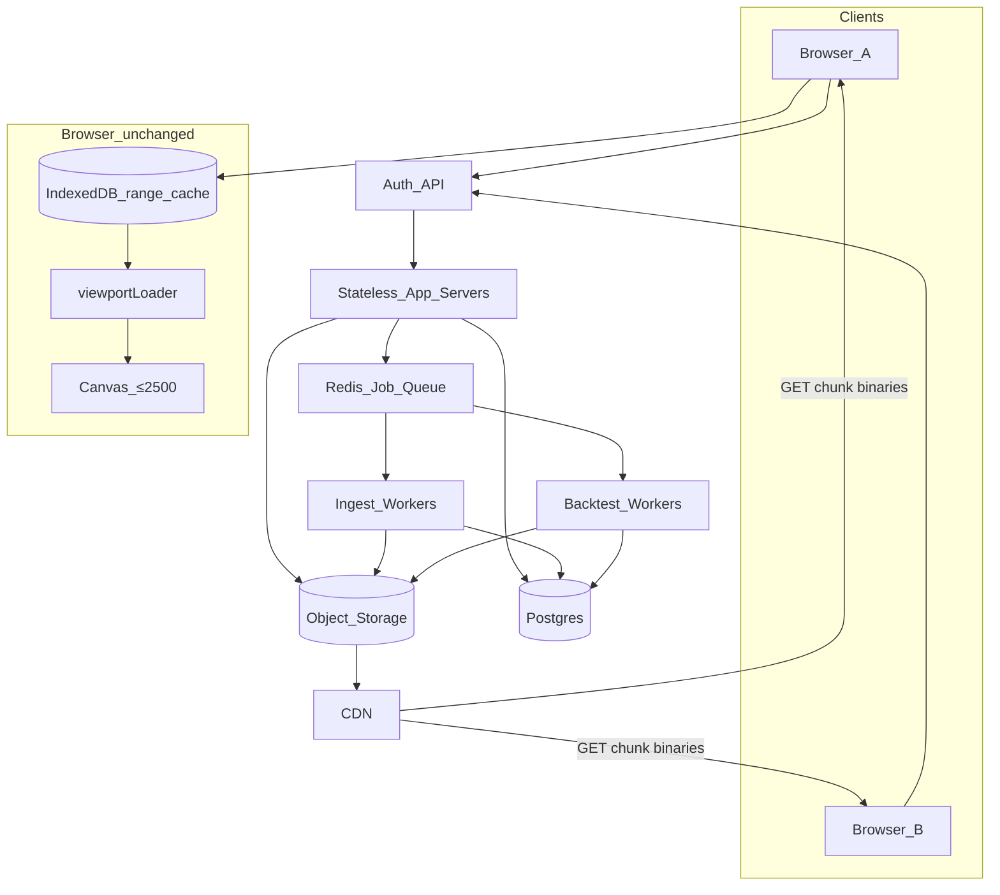

# Architecture

Technical reference for the Talaria-Log engine.

---

## First rule

Low browser memory, low CPU, fast load + fast redraw. The engine is a **dumb viewport renderer** — it never owns the full dataset.

---

## Data Flow



---

## Memory Model

```
Full CSV (1M rows)     →  IndexedDB only      →  ~disk, not RAM
Chunk in worker        →  parse & discard     →  ~5k rows transient
Chart viewport         →  TypedArray / window →  ~2500 bars max
Engine buffer          →  viewport only       →  never full series
```

---

## Data / storage modules

| Module | Responsibility |
|---|---|
| `binaryBar.ts` | Struct-of-Arrays storage, serialize/deserialize |
| `csvWorker.ts` | Off-thread CSV parse, chunk writes |
| `idbStore.ts` | IndexedDB CRUD for bar chunks |
| `barIndex.ts` | Logical index → time range → chunk ID |
| `viewportLoader.ts` | Visible range → fetch → `setViewportBars` |

## Indicator modules (`src/indicators/`)

| Module | Responsibility |
|---|---|
| `defs.ts` | 50 indicator defs (labels, categories, ParamField schemas, defaults) |
| `registry.ts` | `computeIndicatorItem` dispatch |
| `math/helpers.ts` + `math/allIndicators.ts` | Pure TypedArray math (Worker) — MA, oscillators, volume, ICT heuristics |
| `indicatorWorker.ts` | Off-thread compute; OHLC+volume+time in; transfers buffers out |
| `runIndicatorWorker.ts` | Main-thread facade; applies theme colors |
| `themeColors.ts` | Map indicator id → Hero chart colors |

UI: `IndicatorsMenu` (searchable catalog + ⚙ settings) → `IndicatorSettingsModal` (all ParamFields). Caps: 12 overlays / 4 panes.

Layout: main plot → optional volume → N indicator panes (`createLayout` + `drawIndicatorPane`).

ICT overlays (FVG, OB, liquidity, P/D, killzones, BOS, OTE) are **viewport heuristics**, not Pine Script ports.

---

## Full Chart Window modules

Custom Canvas 2D engine under `src/chart/` (not Lightweight Charts). Target layout:

```
src/chart/
  createChart.ts       — engine API + lifecycle
  renderer.ts          — paint orchestration (grid, series, overlays, axes)
  interaction.ts       — pan/zoom/axis drag + hover feed
  crosshair.ts         — Normal | Magnet | MagnetOHLC | Hidden resolution
  series/drawSeries.ts — candle / bar / line painters
  overlays/            — last-price line, crosshair paint helpers
  scales.ts            — logical index ↔ x, price ↔ y
  ticks.ts             — nice time/price tick generation
  chartTheme.ts        — Hero UI CSS vars → canvas colors
  viewportLoader.ts    — visible range → padded fetch → setViewportBars
```

| Module | Role |
|---|---|
| `createChart.ts` | Public API, dirty+rAF loop, viewport buffer ownership |
| `renderer.ts` | Single paint pass: clear → grid → series → overlays → axes |
| `interaction.ts` | Pan / time-axis zoom / price-axis drag; hover feeds crosshair |
| `crosshair.ts` | Mode resolve → snapped index/price for paint + `onCrosshairMove` |
| `series/drawSeries.ts` | Candle / bar / line (and optional volume band) |
| `overlays/` | Last-price line, crosshair + axis-label paint |
| `scales.ts` / `ticks.ts` | Coordinate maps + tick nicening |
| `chartTheme.ts` | Theme tokens only — no hardcoded hex in painters |

**UI chrome vs engine:** Top toolbar, side panels, and bottom status bar are React/Hero UI and live outside the engine. The canvas engine stays a dumb viewport renderer: bars + `VisibleRange` in, pixels out. Chrome never pushes the full dataset into the engine.

---

## Engine API (stable)

Implemented today (`ChartInstance`):

- `setViewportBars(bars)` — replace window only; enforce `MAX_BARS_IN_MEMORY`
- `setVisibleRange(fromIndex, toIndex)` — externalizable for multi-chart sync
- `getVisibleRange()` — read-back for sync bus
- `onVisibleRangeChange(cb)` — interaction emits here
- `setSize(w, h)` / `resetPriceScale()` / `resetTimeScale()`
- `setCrosshairMode` / `getCrosshairMode` / `onCrosshairMove` / `onPlotClick`
- `setSeriesType` / `getSeriesType` / `setShowVolume`
- `setIndicatorOverlays(overlays)` — price-scale series (SMA/EMA/BB), viewport-sized
- `setIndicatorPanes(panes)` — oscillator stack (RSI/MACD); rebuilds layout
- `setDrawings(drawings, draft?)` / `setReplayCursorTime(time)`
- `destroy()` — remove canvas, listeners, cancel rAF

No “load entire series into the chart” API.

**Sync coordinate:** wall-clock time range (multi-TF panes). **Engine buffer:** local logical indices into the current ≤2500-bar window. **Replay:** wall-clock cursor outside engines; App reloads panes via IDB.

### Crosshair API

Modes aligned with Lightweight Charts: `normal` | `magnet` (snap close) | `magnetOhlc` | `hidden`.

- `onCrosshairMove` → `{ index, time, price, bar, barIndex } | null`
- Axis labels for time (bottom) + price (right) painted with the crosshair overlay
- Hover highlight on active bar; last-price line on by default

### Series types

- Main plot: `candle` | `bar` | `line`
- Optional volume histogram in a lower plot band (same viewport window, not a second dataset)

---

## Sync / replay / drawings contracts

| Feature | Contract |
|---|---|
| Replay | `replayStore` cursor is wall-clock time outside engines. On change: publish sync `timeRange` trailing window ending at cursor; panes reload ≤2500 bars from IDB. Never rewrite historical bars in the canvas buffer |
| Multi-chart sync | Share one `createChartSyncStore` → N engines via `attachChartSync`; sync **wall-clock time range** + crosshair time/price; `applyingRemote` + origin guards prevent echo loops |
| Drawings | `drawingStore` models `{ id, type, points: {time, price}[] }`; paint in `drawDrawings` overlay after series / before crosshair; persist per session+dataset in localStorage |
| Indicators | Worker-only math via `src/indicators/registry.ts` (SMA/EMA/BB/RSI/MACD). Overlays on main price scale; oscillators in stacked panes with own Y scales. Viewport TypedArrays only (≤2500). No Pine Script. |
| Freezes | No chart state in React; dirty + single rAF; hard bar cap; full series only in IndexedDB |

### Data path (session)

1. `ensureDatasetIngested` — worker one-pass CSV → IDB chunks for base TF + aggregated TFs (`5m`…`1D`)
2. `SeriesCatalog` in App (ids + row counts + time span) — **no** full TypedArray series
3. `loadViewportAroundTime` / `loadViewportForTimeRange` → `getBarsInRange` → pane `bars`
4. Pan/zoom/replay update sync time → debounced pane reload from IDB

---

## IndexedDB Schema

```
Database: fast-chart (IDB_VERSION)
Store: barChunks
Key: `${datasetId}/${tf}/${chunkIndex}`
Value: ArrayBuffer (packed OHLCV)

Store: metadata
Key: `${datasetId}:${tf}` → SeriesMeta
  { datasetId, timeframe, rowCount, timeStart, timeEnd,
    chunkIds[], chunkStarts[], chunkTimeStarts[], chunkTimeEnds[] }
Key: "dataset" → legacy DatasetMeta (CSV import UI)

Store: datasetCsv
Key: datasetId → raw CSV string
```

---

## CSV Format

```csv
time,open,high,low,close,volume
1704067200,1.1045,1.1052,1.1040,1.1048,1250
```

- `time`: Unix seconds (UTC)
- Sorted ascending
- No header duplicates

---

## Performance Contracts

Every PR touching `src/chart/` or `src/data/` must preserve:

1. Main thread never parses > 1 CSV line synchronously
2. `setViewportBars` receives ≤ `MAX_BARS_IN_MEMORY` (2500)
3. Chart engine stored in `useRef`, not `useState`
4. `engine.destroy()` called on unmount
5. Indicators never computed on the main thread
6. Engine never owns the full series
7. Pan: paint current buffer first; IDB edge refill async (do not block rAF on avoidable full-window remap)
8. Backtest/strategy: compute outside engine; paint markers/equity from results only

---

## Target: Dataset → Backtest (Step 11+)

```
Dataset chunks (IDB / later CDN)
    → Strategy Worker (or server job)
        → signals / orders / fills
            → trade list + equity curve
                → chart overlays + journal UI
```

| Stage | Status | Notes |
|---|---|---|
| Ingest | Done | Worker → IDB chunks + TF pre-agg |
| Chart session | Done | pairs, dates, TF, panes |
| Replay cursor | Done | outside engines |
| Strategy engine | Done (Step 11) | Client Worker; TypedArrays ≤ `MAX_BACKTEST_BARS`; never main-thread full series |
| Equity / trades | Done (Step 11) | `BacktestResult` outside engine; markers + sparse equity overlay |
| Server jobs | Phase 11 / Step 13 | Same result model; queue for large runs |
| Journal | Phase 12 / Step 14 | Persist/review trades without reloading OHLC |

---

## Phase 11 — Multi-user backend (Steps 12–13)

**Step 12 = this doc (contract).** Step 13 implements API + CDN delivery. No production server in this step.

North star unchanged: browser always IDB-caches ranges; React never holds the full series; canvas ≤2500 bars (`MAX_BARS_IN_MEMORY`).

### Multi-user diagram



### Store ownership

| Store | Owns | Does **not** own |
|---|---|---|
| **Object storage + CDN** | Pre-chunked bar binaries per `datasetId` / TF / chunkIndex — **source of truth for OHLC** | User prefs, trades, drawings |
| **Postgres** | users, dataset metadata + ACL, chunk **meta/URLs**, sessions, drawings, trades, journal, job status | Row-per-bar OHLC for charting |
| **Redis / job queue** | Ingest jobs, heavy backtest jobs, short-lived locks/rate limits | Durable trade history |
| **Browser IndexedDB** | Local range cache of fetched chunks (same packed format as today) | Authoritative multi-user history |

**Hard rule:** Do **not** store 15y 1m OHLC as Postgres row-per-bar for chart paint. Bars live as packed `ArrayBuffer` chunks (`BYTES_PER_BAR` = 28, `CHUNK_SIZE` = 5000) on object storage; Postgres holds only metadata + pointers.

### Chunk object layout (CDN / S3)

Mirror the client key scheme so fetch → IDB put is a straight write:

```
object key:  datasets/{datasetId}/{tf}/{chunkIndex}.bin
chunk id:    `${datasetId}/${tf}/${chunkIndex}`   // same as IDB today
payload:     packed OHLCV ArrayBuffer (binaryBar.ts)
```

Series catalog for a TF is described by `dataset_chunks` rows + a small JSON meta blob (or columns) equivalent to client `SeriesMeta`:

```
{ datasetId, timeframe, rowCount, timeStart, timeEnd,
  chunkIds[], chunkStarts[], chunkTimeStarts[], chunkTimeEnds[] }
```

Clients request a **time or logical range**; the API returns the chunk URLs (or signed URLs) covering that range — never a single “download entire series” blob into React state.

### Auth approach (sketch)

Prefer **HTTP-only session cookies** for the web app (CSRF-safe same-site, easy revoke). Optional **JWT access + refresh** for non-browser clients later; same `users` table.

| Piece | Sketch |
|---|---|
| Identity | `users.id` (UUID), email unique, password hash (argon2/bcrypt) or OAuth subject |
| Session | Server-side session row or signed cookie `sid` → Redis/Postgres; TTL + rotate on login |
| JWT (optional) | Short-lived access JWT (`sub`, `sid`, exp ~15m) + refresh cookie; API validates signature |
| Authorization | Every dataset/session/trade route checks `user_id` + ACL (see below) |
| CSRF | SameSite=Lax/Strict cookie + double-submit or Origin check for mutating routes |

Step 13 can ship cookie sessions first; JWT is not required for the first multi-browser demo.

### Dataset ACL notes

| Visibility | Meaning |
|---|---|
| `private` | Owner only |
| `shared` | Explicit grants in `dataset_acl` (read / write / admin) |
| `public_read` | Any authenticated user may list meta + fetch chunks (no write) |

Rules:

- Upload/ingest and ACL changes require `owner` or `admin`.
- Chunk GET requires `read` (or public_read).
- Backtest/jobs that write trades require `read` on the dataset + ownership of the session.
- Never return chunk URLs for datasets the caller cannot read.
- Soft-delete datasets: hide from list; GC object storage asynchronously.

### API sketch (Step 13 contract)

Base: `/api/v1`. Auth on all except health/login/register.

| Method | Path | Purpose |
|---|---|---|
| `POST` | `/auth/register` | Create user |
| `POST` | `/auth/login` | Session / tokens |
| `POST` | `/auth/logout` | Revoke session |
| `GET` | `/auth/me` | Current user |
| `GET` | `/datasets` | List datasets caller can read (meta only — no bars) |
| `GET` | `/datasets/:id` | Dataset meta + available TFs + time span |
| `POST` | `/datasets` | Create dataset row (pending ingest) |
| `POST` | `/datasets/:id/ingest` | Enqueue ingest job (CSV upload URL or multipart → worker) |
| `GET` | `/datasets/:id/chunks` | Query: `tf`, `fromTime`, `toTime` (or logical from/to) → chunk meta + CDN URLs |
| `GET` | `/jobs/:id` | Ingest/backtest job status |
| `POST` | `/sessions` | Create chart/backtest session |
| `GET` | `/sessions` / `GET /sessions/:id` | List / load session |
| `PATCH` | `/sessions/:id` | Update legs, dates, TF |
| `DELETE` | `/sessions/:id` | Delete session (+ cascade drawings optional) |
| `GET/PUT` | `/sessions/:id/drawings` | CRUD drawings JSON for session+dataset |
| `POST` | `/backtests` | Enqueue server backtest job (large runs) |
| `GET` | `/backtests/:id` | Job status + result summary |
| `GET` | `/trades?sessionId=` | Trades for journal / overlays |
| `CRUD` | `/journal_entries` | Notes linked to trades/sessions |

**Chunk range response shape (illustrative):**

```json
{
  "datasetId": "…",
  "timeframe": "1m",
  "seriesMeta": { "rowCount": 0, "timeStart": 0, "timeEnd": 0, "chunks": [
    { "chunkIndex": 0, "chunkId": "…/1m/0", "url": "https://cdn/…/0.bin",
      "logicalStart": 0, "timeStart": 0, "timeEnd": 0, "bytes": 140000 }
  ]}
}
```

Client: fetch binaries → `putChunk` IDB → existing `getBarsInRange` / `viewportLoader` path. Canvas still ≤2500.

### Postgres schema sketch

Types are indicative (UUID PKs, `timestamptz`, JSONB where flexible). Not a migration — Step 13 may adjust names.

#### `users`
| Column | Type | Notes |
|---|---|---|
| `id` | uuid PK | |
| `email` | citext unique | |
| `password_hash` | text null | null if OAuth-only |
| `display_name` | text | |
| `created_at` | timestamptz | |
| `updated_at` | timestamptz | |

#### `datasets`
| Column | Type | Notes |
|---|---|---|
| `id` | uuid PK | = client `datasetId` |
| `owner_user_id` | uuid FK → users | |
| `symbol` | text | e.g. EUR/USD |
| `base_timeframe` | text | e.g. `1m` |
| `name` | text | |
| `visibility` | text | `private` \| `shared` \| `public_read` |
| `status` | text | `pending` \| `ready` \| `failed` |
| `time_start` / `time_end` | bigint | Unix seconds (span across TFs) |
| `row_counts` | jsonb | `{ "1m": n, "5m": n, … }` |
| `created_at` / `updated_at` | timestamptz | |

#### `dataset_acl` (optional but recommended)
| Column | Type | Notes |
|---|---|---|
| `dataset_id` | uuid FK | |
| `user_id` | uuid FK | |
| `role` | text | `read` \| `write` \| `admin` |
| PK | `(dataset_id, user_id)` | |

#### `dataset_chunks` (meta / URLs only — not bar rows)
| Column | Type | Notes |
|---|---|---|
| `id` | uuid PK | |
| `dataset_id` | uuid FK | |
| `timeframe` | text | |
| `chunk_index` | int | |
| `chunk_id` | text unique | `${datasetId}/${tf}/${chunkIndex}` |
| `object_key` | text | storage key |
| `cdn_url` | text null | or mint signed URL at request time |
| `logical_start` | int | bar index at chunk start |
| `bar_count` | int | |
| `time_start` / `time_end` | bigint | |
| `byte_size` | int | |
| `checksum` | text null | e.g. sha256 |
| Unique | `(dataset_id, timeframe, chunk_index)` | |

#### `sessions`
| Column | Type | Notes |
|---|---|---|
| `id` | uuid PK | aligns with client `BacktestSession.id` |
| `user_id` | uuid FK | |
| `name` | text | |
| `timeframe` | text | chart TF |
| `start_date` / `end_date` | date | UTC day window |
| `legs` | jsonb | `[{ pair, datasetId }, …]` |
| `primary_dataset_id` | uuid | first leg |
| `created_at` / `updated_at` | timestamptz | |

#### `drawings`
| Column | Type | Notes |
|---|---|---|
| `id` | uuid PK | |
| `session_id` | uuid FK | |
| `dataset_id` | uuid FK | per-pane series |
| `user_id` | uuid FK | |
| `payload` | jsonb | `{ type, points[{time,price}], style… }` |
| `updated_at` | timestamptz | |

#### `trades`
| Column | Type | Notes |
|---|---|---|
| `id` | uuid PK | = `BacktestTrade.id` when from backtest |
| `user_id` | uuid FK | |
| `session_id` | uuid FK | |
| `dataset_id` | uuid FK | |
| `backtest_run_id` | uuid null | null for manual/live later |
| `side` | text | buy / sell |
| `entry_time` / `exit_time` | bigint | Unix seconds |
| `entry_price` / `exit_price` | double | |
| `pnl` / `pnl_pct` | double | |
| `source` | text | `backtest` \| `manual` \| `live` |
| `created_at` | timestamptz | |

#### `journal_entries`
| Column | Type | Notes |
|---|---|---|
| `id` | uuid PK | |
| `user_id` | uuid FK | |
| `session_id` | uuid null | |
| `trade_id` | uuid null FK → trades | |
| `title` | text | |
| `body` | text | |
| `tags` | text[] | |
| `created_at` / `updated_at` | timestamptz | |

#### Supporting (Step 13 as needed)

| Table | Role |
|---|---|
| `jobs` | `id`, `type` (`ingest`\|`backtest`), `status`, `user_id`, `payload` jsonb, `error`, timestamps |
| `backtest_runs` | Persist full `BacktestResult`-shaped summary: params, bar_count, truncated, equity jsonb (sparse), totals |
| `sessions_auth` / Redis | Server session store if not JWT-only |

### Client ↔ server contracts (non-negotiable)

1. **Browser IDB still caches ranges** — CDN/API is remote source; local `barChunks` + `SeriesMeta` remain the paint path.
2. **Never download the full series into React state** — catalog + meta only in App; bars only as viewport TypedArrays / chart buffer.
3. **Canvas ≤2500** — `setViewportBars` / `MAX_BARS_IN_MEMORY`; server must not introduce a “load all bars” chart API.
4. **Workers stay for indicators + local backtest** — main thread never parses CSV or runs strategy math.
5. **Pan/prefetch/LOD** — edge refill and TF coarsen keep working against IDB whether chunks came from CSV upload or CDN fetch.

### Client backtest Worker ↔ future server jobs

Step 11 client path:

```
IDB range → TypedArrays (≤ MAX_BACKTEST_BARS)
  → backtestWorker (sma_cross + cost stubs)
    → BacktestResult { trades, equity, finalEquity, totalPnl, params, … }
      → backtestStore + chart overlays (markers / sparse equity)
```

Server job path (Step 13+):

```
Job queue → worker reads chunk binaries from object storage (same pack format)
  → same strategy math / params schema
    → persist trades + backtest_runs (BacktestResult-compatible JSON)
      → client GETs result → same overlays / journal UI
```

| Concern | Client Worker (now) | Server job (later) |
|---|---|---|
| Input bars | IDB → TypedArrays | Object storage chunks → TypedArrays |
| Cap | `MAX_BACKTEST_BARS` (50k) | Higher OK; still stream/chunk internally; return sparse equity |
| Result model | `BacktestResult` / `BacktestTrade` / `EquityPoint` | **Same fields** (wire JSON); chart code unchanged |
| Cancellation | generation bump + `terminate()` | job cancel + status `cancelled` |
| When to use | Interactive / session-sized runs | Multi-user heavy runs, shared datasets, persistence |

Do not invent a second trade/equity shape for the server — extend `BacktestResult` if needed.

### Step 13 implementation boundary

**Shipped (Vite middleware stub — no Postgres/Redis/Docker required for `npm run dev`):**

| Piece | Location |
|---|---|
| API plugin | `server/apiPlugin.ts` mounted in `vite.config.ts` alongside Dukascopy |
| Disk chunk store | `data/chunks/datasets/{datasetId}/{tf}/{n}.bin` (+ `dataset.json` / `series.json`) |
| Job queue | `server/jobQueue.ts` in-memory stub |
| Client helper | `src/datasets/remoteApi.ts` + `src/datasets/ingestRemoteChunks.ts` |

**Base path:** `/api/v1` (matches sketch). Implemented now:

| Method | Path | Notes |
|---|---|---|
| `GET` | `/api/v1/health` | Public |
| `GET` | `/api/v1/auth/me` | Dev stub user |
| `POST` | `/api/v1/auth/login` \| `/register` \| `/logout` | Dev stub |
| `GET` | `/api/v1/datasets` | Meta only (seeded demo dataset) |
| `GET` | `/api/v1/datasets/:id` | Dataset meta |
| `GET` | `/api/v1/datasets/:id/chunks` | `tf`, `fromTime`, `toTime` → chunk meta + relative URLs |
| `GET` | `/api/v1/files/datasets/:id/:tf/:n.bin` | Packed OHLCV binary (CDN stand-in) |
| `POST` | `/api/v1/jobs/ingest` | In-memory job stub |
| `POST` | `/api/v1/jobs/backtest` | Placeholder only |
| `GET` | `/api/v1/jobs/:id` | Job status |
| `POST` | `/api/v1/datasets/:id/ingest` | Enqueue ingest stub |

Auth: fixed dev user; optional `X-Talaria-User-Id` header (display only). Not production security.

**Default client path unchanged:** Create Session / Dukascopy / local IDB ingest remain offline-capable. Remote → IDB is available from Datasets → **Import from API** (`ingestRemoteDatasetAllTfs` → catalog `source: 'remote'`).

**Journal (Step 14):** local-only `journalStore` + `JournalPage` (trades/equity stats; no OHLC). Postgres journal sync still out of scope.

Out of scope still: Express/Fastify production server, Postgres, Redis, OAuth.

---

## Tech Versions

| Dependency | Version policy |
|---|---|
| Custom Canvas 2D engine | in-repo (`src/chart/`) |
| @heroui/react | latest v3 |
| React | ^19 |
| Vite | ^6 |
| TypeScript | strict |

Update this doc when major dependencies change.
