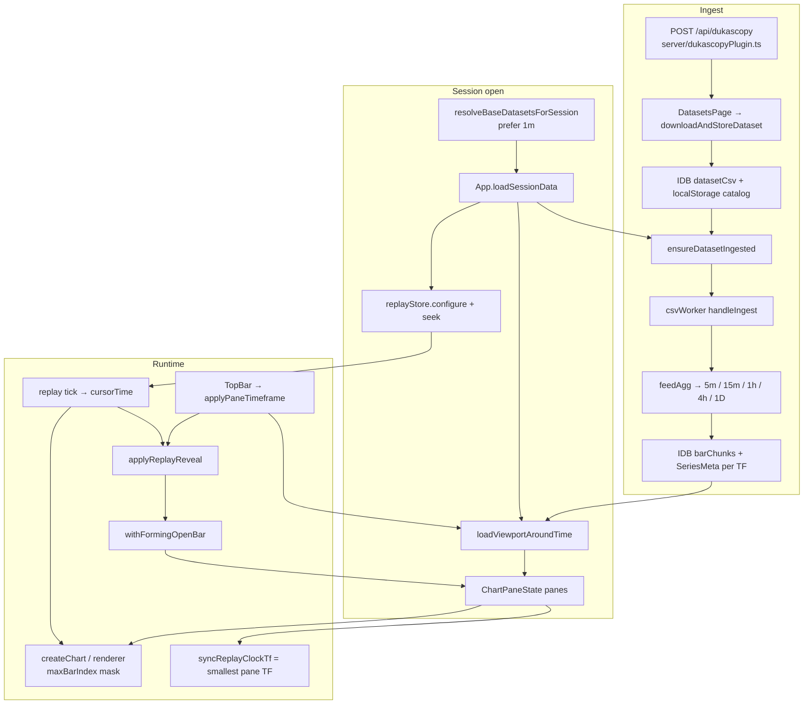

# Talaria-Log — Data → 1m → Replay → Timeframe Switch

**Audience:** advisor / architect review  
**Date:** 2026-07-30  
**Scope:** how market data enters the app, becomes 1-minute (and coarser) series, drives replay, and behaves when the user switches timeframe.

---

## 1. One-paragraph mental model

Dukascopy (or CSV) is stored as raw text, then lazily parsed in a **Web Worker** into **per-timeframe IndexedDB chunk series** (base usually **1m**, plus pre-aggregated 5m / 15m / 1h / 4h / 1D). The chart never holds the full history in React: `App` loads ≤2500-bar **viewports** into panes. Replay advances a single wall-clock **`cursorTime`**; the Canvas engine **masks** bars after that cursor (`maxBarIndex`). Multi-pane replay steps on the **finest pane TF**; coarser panes show a **forming** open candle built from that clock. TopBar TF switch reloads the pane’s series at the new TF and must keep the camera on the **revealed** side of the cursor.

---

## 2. End-to-end flow



---

## 3. Stage A — Data comes in

| Step | File | Key symbols | What happens |
|------|------|-------------|--------------|
| Dukascopy fetch | `server/dukascopyPlugin.ts` | Vite middleware, `getHistoricalRates` | `POST /api/dukascopy` returns CSV (avoids browser CORS) |
| Download UI | `src/components/dataset/DatasetsPage.tsx` | `handleDownload` | Prefers **1m** downloads; size gates |
| Catalog + raw CSV | `src/datasets/datasetStore.ts` | `downloadAndStoreDataset`, `listDatasets` | Catalog in `localStorage`; CSV blob in IDB `datasetCsv` |
| Size gates | `src/datasets/ingestLimits.ts` | `assessDownloadSize`, `assessCsvUpload` | Warn / confirm / block large spans |
| Session resolve | `src/datasets/resolveBaseDataset.ts` | `resolveBaseDatasetsForSession` | Prefers a covering **1m** dataset per pair |
| Lazy ingest | `src/datasets/ingestDataset.ts` | `ensureDatasetIngested`, `runIngestWorker` | On session open: worker parse → write chunks |
| Worker | `src/data/csvWorker.ts` | `handleIngest`, `feedAgg`, `finalizeAgg` | Off main thread; no full CSV as JS objects on UI thread |

**Legacy path (not the session pipeline):** `src/hooks/useCsvImport.ts` + TopBar upload uses older `parse` mode — not the multi-TF ingest used by backtest sessions.

---

## 4. Stage B — Convert / store as 1m (+ coarser TFs)

### IndexedDB (`fast-chart` v2)

| Store | Key | Value |
|-------|-----|-------|
| `barChunks` | `{datasetId}/{timeframe}/{chunkIndex}` | Packed `ArrayBuffer` (~28 bytes/bar) |
| `metadata` | `{datasetId}:{timeframe}` | `SeriesMeta` |
| `datasetCsv` | `datasetId` | Raw CSV string |

Constants: `src/utils/constants.ts` — `CHUNK_SIZE = 5000`, `MAX_BARS_IN_MEMORY = 2500`, `REPLAY_VISIBLE_BARS = 120`.

### Aggregation rules (`src/data/csvWorker.ts` + `src/data/timeframeAgg.ts`)

1. Base TF = dataset TF (usually **1m**): every CSV row → one bar.
2. `aggregatableTimeframes(baseTf)` → all coarser TFs (`5m`, `15m`, `1h`, `4h`, `1D`).
3. `feedAgg`: bucket by `floor(time / period) * period` → OHLC (H/L extremes, last C, sum V).
4. Completed buckets flushed to chunks; `finalizeAgg` closes the last open bucket.
5. Main thread: `putChunk` / `putSeriesMeta` per TF.

**Important:** Session charts load **pre-written IDB series per TF**. They do **not** re-aggregate the full history on every TF click. Forming candles during replay are the exception (open bucket only, from clock TF).

If only a coarser file exists (e.g. 1h), finer TFs (1m/5m) are unavailable.

### Binary / index helpers

| File | Role |
|------|------|
| `src/data/binaryBar.ts` | SoA TypedArrays, pack/unpack |
| `src/data/barIndex.ts` | `chunkIndexForTime` / logical |
| `src/data/idbStore.ts` | `getBarsInRange`, `putChunk`, `putSeriesMeta` |
| `src/types/series.ts` | `SeriesMeta`, `SeriesCatalog` |

---

## 5. Stage C — Session open → chart panes

**Orchestrator:** `src/App.tsx` → `loadSessionData`

1. Resolve + ingest each session leg (`ensureDatasetIngested`).
2. Pick `openTf` (session TF if ingested, else first shared TF).
3. Compute replay bounds: session dates ∩ catalog time range.
4. Open **one pane** (`pane-0`) even for multi-pair sessions (extra pairs via TopBar symbol switcher).
5. `loadViewportAroundTime(datasetId, openTf, timeStart)` → ≤2500 bars.
6. Camera: `rangeCenteredOnIndex(0, REPLAY_VISIBLE_BARS)`.
7. `replay.configure(start, end, windowSec)` + `seek(firstBar.time)`.
8. Enable pan/zoom viewport reload.

**Viewport API:** `src/datasets/seriesViewport.ts`

- `loadViewportAroundTime` — window around an anchor time  
- `loadViewportForTimeRange` — multi-pane / LOD wall-clock sync  
- `timeToLogicalIndex` — binary search in IDB  

**Pane state:** `src/types/pane.ts` → `ChartPaneState`  
(`timeframe` = effective, `selectedTf` = TopBar floor for zoom LOD)

**Engine bridge:** `src/hooks/useChart.ts` → `src/chart/createChart.ts`

---

## 6. Stage D — Replay

| Layer | File | Behavior |
|-------|------|----------|
| Controller | `src/replay/replayStore.ts` | `cursorTime` on active TF grid; play = N bars/sec; step/seek/scrub |
| App subscribe | `App.tsx` | On cursor change → `applyReplayReveal` |
| Reveal | `App.applyReplayReveal` | Refresh IDB buffer if needed; apply forming; **does not** rewrite camera range |
| Mask | `src/chart/renderer.ts` + `drawSeries.ts` | `maxBarIndex = indexAtOrBeforeBars(bars, cursorTime)` — future bars stay in memory but are not painted |
| Follow | `createChart` | While playing (and not detached), center on live candle |
| UI | `src/components/layout/BottomBar.tsx` | Play / pause / step / speed / scrub |

### Multi-TF clock + forming

| Piece | File | Role |
|-------|------|------|
| Clock TF | `App.syncReplayClockTf` + `smallestTimeframe` | Finest pane TF drives step size for **all** panes |
| Forming | `src/replay/formingBars.ts` | Open coarse candle OHLC rebuilt from clock bars up to cursor |
| Clock buffers | `clockBufferRef` in `App.tsx` | Per-`datasetId` viewport at clock TF |

Example: panes at 1m + 5m + 1h → clock = **1m**; 5m/1h open candles update tick-by-tick until the bucket closes.

---

## 7. Stage E — Switch timeframe (TopBar)

**UI:** `TopBar` → `TimeframePicker` → `applyPaneTimeframe(activePaneId, tf)`  
(Pane legend is read-only; select pane, then change TF in the top bar.)

**Intended TV behavior** (`applyPaneTimeframe` in `App.tsx`):

1. Read **live** camera from chart engine (`getChart(id).getVisibleRange()`), not stale React `pane.range`.
2. Preserve **candle count** (`span`).
3. Because replay **always masks** after `cursorTime`, clamp anchor to `min(visibleRight, cursorTime)`.
4. Load new TF: `loadViewportAroundTime(..., anchor, span)`.
5. Set range with `revealRangeAtCursor(bars, cursorTime, span)` so the right edge is the last revealed bar.
6. Seed `replayBufferRef`; refresh via `applyReplayReveal`.
7. If playing, keep camera follow attached.

### Why 1m → 4h → 1m can look broken

| Failure mode | Cause |
|--------------|--------|
| Empty chart / one huge candle | Camera centered **past** replay cursor → almost all bars masked |
| Jump / wrong zoom | Used stale React range, or preserved **wall-clock** window instead of **bar count** |
| Needs Play to “fix” | Play advances cursor / re-follows / reloads buffers |

Recent fixes (session log): live engine range, bar-count preserve, cursor-clamped reveal range, buffer refresh after TF switch. Further hardening may still be needed around LOD, detached camera, and clock-TF changes when one pane’s interval changes.

---

## 8. Key types (contracts)

```ts
// src/types/ui.ts
type Timeframe = '1m' | '5m' | '15m' | '1h' | '4h' | '1D';

// src/types/bar.ts
interface ChartBar {
  time: number; // unix seconds
  open: number; high: number; low: number; close: number;
  volume?: number;
}
interface VisibleRange { fromIndex: number; toIndex: number; }

// src/types/series.ts — SeriesMeta (IDB), SeriesCatalog (App handle)

// src/types/pane.ts — ChartPaneState
// timeframe = effective (may LOD-coarsen)
// selectedTf = last explicit TopBar pick (LOD floor)
```

---

## 9. File inventory (give this list to the advisor)

| Area | Path |
|------|------|
| Orchestrator | `src/App.tsx` |
| Dukascopy server | `server/dukascopyPlugin.ts` |
| Datasets UI | `src/components/dataset/DatasetsPage.tsx` |
| Catalog / CSV store | `src/datasets/datasetStore.ts` |
| Resolve 1m base | `src/datasets/resolveBaseDataset.ts` |
| Ingest orchestration | `src/datasets/ingestDataset.ts` |
| Limits | `src/datasets/ingestLimits.ts` |
| Viewport loads | `src/datasets/seriesViewport.ts` |
| Zoom LOD | `src/datasets/zoomLod.ts` |
| CSV worker | `src/data/csvWorker.ts` |
| IDB | `src/data/idbStore.ts` |
| Binary bars | `src/data/binaryBar.ts` |
| Chunk index | `src/data/barIndex.ts` |
| TF math / reveal | `src/data/timeframeAgg.ts` |
| Replay controller | `src/replay/replayStore.ts` |
| Forming bars | `src/replay/formingBars.ts` |
| Chart engine | `src/chart/createChart.ts` |
| Paint + mask | `src/chart/renderer.ts`, `src/chart/series/drawSeries.ts` |
| Chart registry | `src/chart/chartRegistry.ts` |
| React bridge | `src/hooks/useChart.ts` |
| TopBar / TF UI | `src/components/layout/TopBar.tsx`, `TimeframePicker.tsx` |
| Pane / grid | `src/components/layout/ChartPane.tsx`, `ChartGrid.tsx` |
| Replay UI | `src/components/layout/BottomBar.tsx` |
| Types | `src/types/{bar,series,pane,ui,dataset}.ts` |
| Constants | `src/utils/constants.ts` |

---

## 10. Pipeline hardening contracts (I0–I5, 2026-08-11)

**Production ingest (only):**
- Local: Datasets → `downloadAndStoreDataset` → IDB `datasetCsv` → session `ensureDatasetIngested` → worker `ingest`
- Remote: `ensureSessionDataFromServer` / `ingestRemoteChunksToIdb` → same `barChunks` + `SeriesMeta`

**Forbidden for chart display:**
- Materializing full history via `parseAll` / `loadDatasetSeries`
- Loading chart bars by re-parsing whole CSV (`parseForChart` / `loadDatasetBars`)
- Legacy TopBar `parse` chunk keys (`symbol_chunk_N`) — not the session multi-TF path

**Retention:** Raw CSV stays in IDB for re-ingest recovery. Packed chunks are the paint source of truth. Streaming ingest + optional CSV GC = **I5** (not this wave).

**Debug:** last ingest run → `window.__talariaPipeline` (see `src/datasets/pipelineMetrics.ts`).

## 11. Open gaps (advisor checklist)

1. **TF switch under replay mask** — improved, still edge-case sensitive (LOD, detached camera, engine not ready).
2. **Clock TF side effect** — changing one pane’s TF can change play step size for all panes (`smallestTimeframe`).
3. **Legacy CSV upload ≠ session ingest** — quarantined; session path is canonical.
4. **Dataset delete** — may leave orphaned bar chunks / meta in IDB.
5. **No finer-than-base** — cannot invent 1m from a 1h-only download.
6. **Ingest RAM spike** — whole CSV still posted to worker (I5 streaming).

---

## 12. Suggested questions for the advisor

1. Should TF switch preserve **bar count** (current) or **wall-clock window** (TradingView sometimes does both depending on mode)?
2. Should replay **exit** the mask when the user is not playing (show full history), or always stay in “replay session” mode?
3. Should the replay clock stay fixed at dataset **base TF (1m)** even if no pane shows 1m?
4. Is pre-aggregating all TFs at ingest the right cost tradeoff vs aggregating on the fly from 1m?
5. How should multi-pane + multi-symbol sessions default (1 pane vs N panes)?

---

*Generated for advisor review from the Talaria-Log / fast-chart codebase. Update this file when the pipeline changes.*
